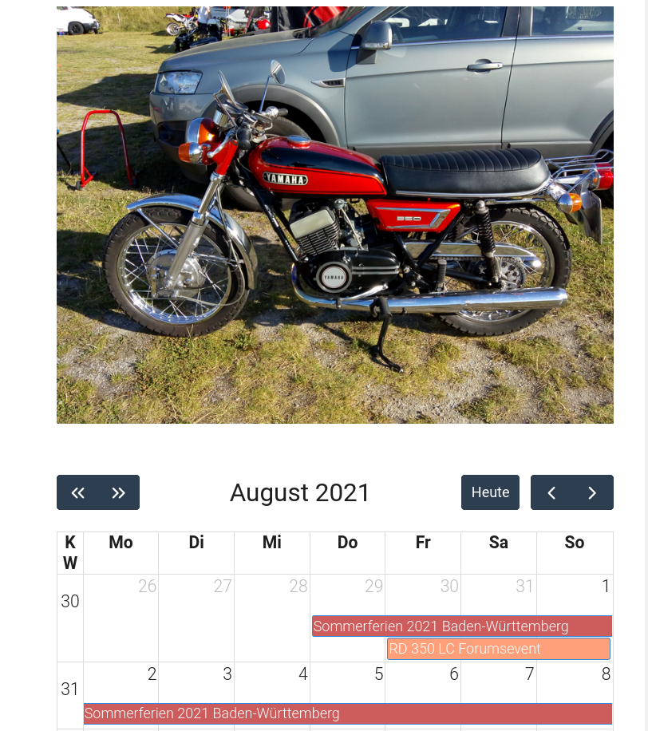

# Fullcalendar Shortcode

**Fullcalendar** is a Shortcode for [Hugo](https://gohugo.io).  
Actually, this is a port of the [Grav Plugin Fullcalendar](http://github.com/wernerjoss/grav-plugin-fullcalendar), it reads ICS Calendar Files and shows Events in a monthly Calendar Widget on your Page(s) - including Month Specific Images (if available in the calendar page folder):



## Installation/Loading necessary scripts

Installing the Fullcalendar plugin can be done in one of two ways. 
1. Copy the layouts folder over (containing the shortcut)
2. Copy the static folder (js & fc4)
3. Copy your .ics File(s) to your Calendar Page Folder and adapt the Settings (see Configuration) accordingly
4. Call the load shortcut in the Page where your Calendar should be shown (AND where your .ics calendar files are): 

## Usage

Once installed, you can use this Plugin to parse ICS Calendar File(s) - these must be found in same folder where you add the shortcode in your calendar.md file, e.g
```
blog/calendar
├── calendar.md
├── events.ics
└── holidays.ics
```
The Calendar Files will be picked up automatically, there is no (more) need to explicitly specify them as Parameters in the Shortcode (from v1.2.0).  
In calendar.md, the shortcode must be added somewhere like this:

    

## Configuration
Besides locale, there is also a Paramter called colors, e.g ``` colors="Red,Green,Blue" ``` which can be used to customize the colors of the Calendar Entry in the Grid view.  
Further Configuration can be done in the File js/calendar.js in function Settings(), but keep in mind these could be overwritten by an update.  
As mentioned, you can also show a Picture for the current month above the calendar widget (see screenshot obove), just put 12 Image Files named 'January.jpg', 'February.jpg', ... , 'December.jpg' in the Folder for your Page where the Calendar will be placed.  
(Note that Image File names must match Month names according to your locale setting, so, for locale: de, use 'Januar.jpg' ...).  
Finally, it should be noted that this Shortcode relies on jquery, which is loaded by most Themes - in case you are using a Theme that does not do this, jquery is automatically loaded, no additional config Option needed for that.  

## Advanced Usage
As an addition to the standard use case, there is an elegant way to automatically update your .ics Files from remote Calendars in case those are hosted on a CalDav Server (e.g. Owncloud, Nextcloud...):
In this case, you can just use [caldav2ics](https://github.com/wernerjoss/caldav2ics) via cron job to automatically update your ics Files shown by the Fullcalendar Shortcode, so that remote Calendar content, usually maintained in separate Calendar Apps (such as Google Calendar or Lightning) is automatically propagated to your Website.  

## CORS Issues:
As CORS is a PITA, I dropped Support for this, so, yes, only ics Calendar Files on the same Server are supported :smile:.

## Timezone Issues:
This refers to [issue #44](https://github.com/wernerjoss/grav-plugin-fullcalendar/issues/44) which has recently come up and turned out to be a major mess with fullcalendar.io v4 (referred to fc4 in the following).  
Although having added the timezone-aware js Librarys from the fc4 packages, I could not find a way to automatically adjust for the diverse practical use cases/calendar incarnations.  
So I decided to implement some additional settings for the plugin, which can be used to correct for date/time shifts for single/recurring events (yes, it is unfortunately necessary to handle those separately, even w.r. to Daylight Saving Times).  
Anyone having issues with incorrectly displayed Events Times, can now fiddle with these settings until everything looks ok - see the Hints in the admin backend.  
Of course, this is not a really satisfactory Solution, I think the real cause is buried in some bugs of the fc4 release. Maybe (hopefully) the fc5 incarnations are better suited to this - porting this Plugin to fc5 is planned anyway, but will probably not happen in the near future.  
So, for the time beeing, I hope most users can live with the workarounds presented here from Plugin Version 0.3.0.

## Credits

This Shortcode is built on [fullcalendar.io](https://fullcalendar.io), [jakubroztocil/rrule](https://github.com/jakubroztocil/rrule) and [jsical](http://mozilla-comm.github.io/ical.js) - Javascript parser for rfc5545

## To Do

* make Configuration easier and Update-safe by Parameters to the Shortcode
* (maybe) Upgrade included Fullcalendar.io to Version 5 (currently: Version 4)
